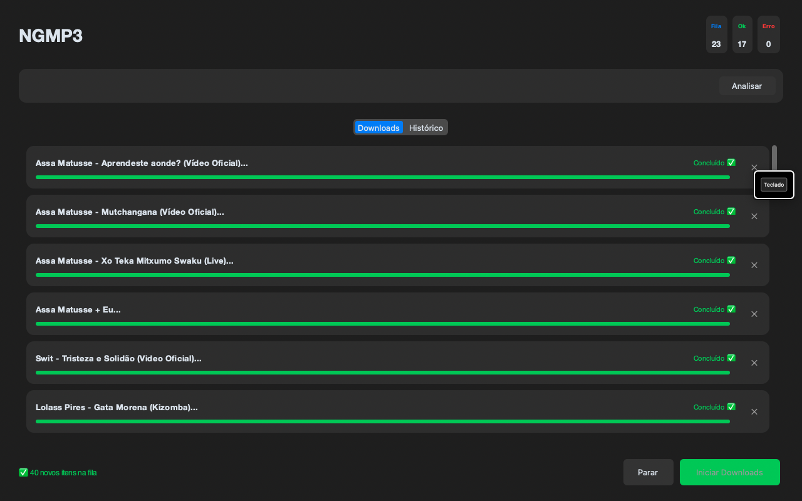
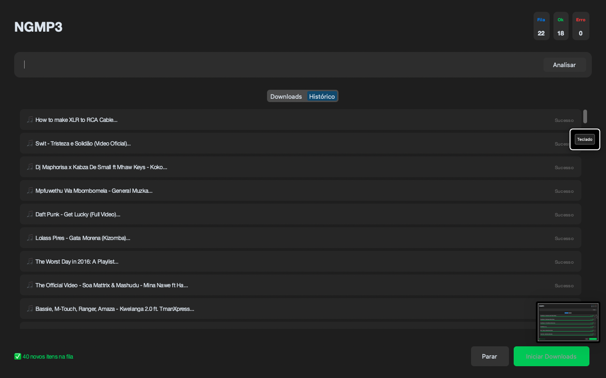

# NGMP3 - Media Downloader Pro 🎧

O **NGMP3** é um aplicativo desktop profissional construído em Python, focado na eficiência e na estética nativa do macOS. Ele permite baixar áudios do YouTube em MP3 de alta fidelidade (320kbps), processando metadados e capas automaticamente.

---

## 📸 Interface do Aplicativo

Para proporcionar a melhor experiência, o app conta com uma interface limpa e intuitiva:

| Tela Inicial (Downloads) | Histórico de Atividade |
| :---: | :---: |
|  |  |

---

## ✨ Funcionalidades Pro
- **⚡ Multithreading:** Downloads em paralelo (até 3 arquivos simultâneos) para máxima velocidade.
- **🔗 Processamento Inteligente de Links:** Suporte para colar listas de links separados por vírgula, espaços ou novas linhas usando Regex.
- **🖼️ Metadados Completos:** Embutimento automático de Thumbnail, Título e Artista no arquivo final.
- **📊 Dashboard de Status:** Contadores em tempo real para itens em fila, concluídos e falhas.
- **💾 Histórico Elegante:** Registro visual de todas as atividades salvas em banco de dados SQLite.
- **🛠️ Controle Total:** Opções para remover itens individuais da fila ou interromper o processo global.

## 🛠️ Tecnologias Utilizadas
- [Python 3.x](https://www.python.org/)
- [yt-dlp](https://github.com/yt-dlp/yt-dlp) - Motor de download de alta performance.
- [CustomTkinter](https://github.com/TomSchimansky/CustomTkinter) - UI moderna com estilo Apple.
- [FFmpeg](https://ffmpeg.org/) - Conversão de áudio e processamento de imagem.
- [SQLite3](https://www.sqlite.org/) - Persistência de dados local.

## 🚀 Como Executar

### Pré-requisitos
É essencial ter o **FFmpeg** instalado para a conversão de MP3 e embutimento de capas:
- **macOS:** `brew install ffmpeg`
- **Windows:** Baixe o binário e adicione ao PATH do sistema.

### Instalação e Uso
1. Clone o repositório:
   ```bash
   git clone [https://github.com/seu-usuario/NGMP3.git](https://github.com/seu-usuario/NGMP3.git)
   cd NGMP3